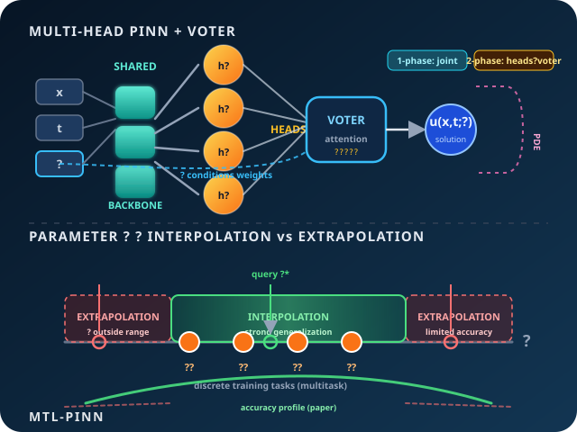

<h1 align="center">Physics-aware Multitask Learning for Parametric PDEs</h1>

<p align="center">
  <a href="logo.svg">
    
  </a>
</p>

<p align="center">
  <strong>Architecture (top):</strong> inputs <code>(x, t, μ)</code> → shared backbone → task heads → voter (attention) → solution <code>u(x,t;μ)</code>, with physics residuals in the loss.<br/>
  <strong>Generalization (bottom):</strong> training tasks at discrete <code>μ₁…μ₄</code>; strong performance when querying <em>inside</em> the training range (interpolation), limited accuracy <em>outside</em> it (extrapolation).
</p>

---

Official PyTorch implementation of the multitask Physics-Informed Neural Network (PINN) described in:

> **Physics-aware Multitask Learning for Solving Parametric Partial Differential Equations**  
> Jon Ander Rivera, Javier Del Ser

The code trains multi-head PINNs with a **voter network** (attention over heads) for three parametric benchmarks:

| Benchmark | PDE / problem | Parameter |
|-----------|----------------|-----------|
| `lambda_x2` | \(-u_{xx} + 2\lambda = 0\), \(u(x;\lambda)=\lambda x^2\) | \(\lambda\) |
| `heat` | \(u_t = p\, u_{xx}\), \(u(x,0)=\sin(\pi x)\) | \(p\) |
| `burgers` | \(u_t + u u_x - \nu u_{xx} = 0\) | \(\nu\) (viscosity) |

Two training strategies from the paper are supported:

- **One-phase**: shared backbone, all heads, and voter network trained jointly.
- **Two-phase**: specialize heads on discrete training parameters, then train only the voter network.

## Repository layout

```
├── mtl_pinn/              # Python package
│   ├── heat/              # Heat equation
│   ├── burgers/           # Burgers equation
│   └── lambda_x2/         # λx² elliptic benchmark
├── outputs/               # Checkpoints and loss logs (created at runtime)
├── paper/                 # Manuscript PDF
├── logo.svg               # Repository logo
├── logo-icon.svg          # Compact icon (128×128)
├── requirements.txt
├── CITATION.bib
└── README.md
```

## Requirements

- Python 3.10+
- PyTorch, NumPy, SciPy, Matplotlib (see `requirements.txt`)

## Installation

```bash
git clone https://github.com/YOUR_USERNAME/physics-aware-mtl-pinn.git
cd physics-aware-mtl-pinn

python -m venv .venv
source .venv/bin/activate   # Windows: .venv\Scripts\activate

pip install -r requirements.txt
pip install -e .
```

Use a CUDA-enabled PyTorch build if you want GPU training (`--device cuda`).

## Quick start

Each benchmark is run as a module. **Prediction** expects checkpoints from **both** strategies in the same `--output-dir`.

### 1. λx² benchmark (fastest)

```bash
# Train one-phase and two-phase models (~30k + 5k voter iterations for two-phase)
python -m mtl_pinn.lambda_x2 train --strategy one-phase --device auto
python -m mtl_pinn.lambda_x2 train --strategy two-phase --device auto

# Compare strategies at λ = 2 and λ = 8 (interpolation)
python -m mtl_pinn.lambda_x2 predict --params 2 8 --save-figure outputs/lambda_x2/comparison.png
```

Training tasks: \(\lambda \in \{0.5, 1.5, 2.5, 3.5\}\).

### 2. Heat equation

```bash
python -m mtl_pinn.heat train --strategy one-phase
python -m mtl_pinn.heat train --strategy two-phase

python -m mtl_pinn.heat predict --params 0.15 0.8 --save-figure outputs/heat/comparison.png
```

Training tasks: \(p \in \{0.05, 0.1, 0.2, 0.3\}\). Default training: 50k head iterations + 10k voter iterations (two-phase).

### 3. Burgers equation

```bash
python -m mtl_pinn.burgers train --strategy one-phase
python -m mtl_pinn.burgers train --strategy two-phase

python -m mtl_pinn.burgers predict --params 0.015 0.08 --save-figure outputs/burgers/comparison.png
```

Training tasks: \(\nu \in \{0.005, 0.01, 0.02, 0.03\}\). Default training: 100k + 20k voter iterations (two-phase).

## CLI reference

Common options (all benchmarks):

| Option | Description |
|--------|-------------|
| `train` / `predict` | Command |
| `--strategy {one-phase,two-phase}` | Training strategy (train only) |
| `--output-dir PATH` | Defaults to `outputs/<benchmark>/` |
| `--device {auto,cpu,cuda}` | Compute device |
| `--seed INT` | Random seed (default: 50) |
| `--head-epochs INT` | Head / joint training iterations |
| `--attn-epochs INT` | Voter-only iterations (two-phase only) |
| `--params FLOAT ...` | Parameter values for `predict` |
| `--save-figure PATH` | Save comparison figure (non-interactive backend) |
| `--show` | Open an interactive matplotlib window |

Example: shorter smoke test on heat

```bash
python -m mtl_pinn.heat train --strategy two-phase --head-epochs 500 --attn-epochs 100
```

## Outputs

After training, each strategy writes:

- `model_one_phase.pth` or `model_two_phase.pth` — full model (torch.save)
- `backbone_*.pth` — shared layer weights
- `loss_*.txt` — loss traces

## Reproducing paper figures

The `predict` command regenerates the side-by-side contour plots comparing one-phase vs two-phase models at user-specified parameter values (interpolation). Use `--show` for interactive Qt windows on a desktop, or `--save-figure` for headless servers.

Additional plotting utilities (head grids, analytical baselines, loss curves) live in `mtl_pinn/<benchmark>/core.py` and can be called from a short script after loading checkpoints with `load_models()`.

## Citation

If you use this code, please cite:

```bibtex
@article{rivera2026physicsawaremtl,
  title   = {Physics-aware Multitask Learning for Solving Parametric Partial Differential Equations},
  author  = {Rivera, Jon Ander and Del Ser, Javier},
  journal = {Preprint},
  year    = {2026},
  note    = {Submitted to Elsevier. Corresponding author: jonander.rivera@ehu.eus},
  keywords = {Multitask Learning, Physics-Informed Neural Networks, Parametric Partial Differential Equations}
}
```

The same entry is in [`CITATION.bib`](CITATION.bib). Update the `journal`, `volume`, `pages`, and `doi` fields when the article is published.

## Authors

- **Jon Ander Rivera** — Department of Applied Mathematics, University of the Basque Country (UPV/EHU)
- **Javier Del Ser** — TECNALIA / Department of Mathematics, UPV/EHU

## License

MIT License (see `pyproject.toml`). Replace or extend as needed before publication.
